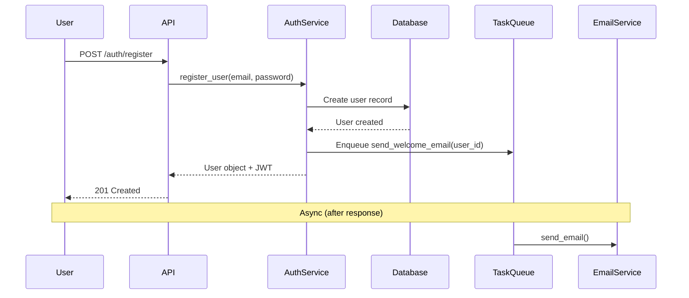

# Design Command Examples

Reference examples for `/design` usage patterns.

## Example 1: Complex Feature with Clarification Gate

```bash
/design .claude/context/user-export-prd.md

# Stage 0: Claude analyzes PRD → finds missing critical info
# Stops ONCE with batch questions about scale, performance, format, security
# User answers, Claude proceeds autonomously

# Generates: TDD, ADRs, BDD, 4 tickets (21 points total)
```

## Example 2: Simple Feature, Autonomous (No Questions)

```bash
/design "Add email validation to user registration"

# Stage 0: Requirements CLEAR (trivial scale, standard pattern)
# Decision: PROCEED autonomously (zero interaction)
# Generates: 1 ticket (2 points)
```

## Example 3: From Epic

```bash
/gather EPIC-42
/design .claude/context/EPIC-42.md

# Claude analyzes epic, identifies 4 user stories
# Creates feature-level architecture
# Breaks into detailed tickets with dependencies
```

## Example 4: Multi-Service Split (Production)

```bash
/design --split=services .claude/context/user-registration-prd.md

# Identifies 3 services: api-gateway, user-service, email-service
# Output: per-service tickets with cross-service contracts
# Teams can work in parallel after contract agreement
```

## Example 5: Personal Project (Default Monolith)

```bash
/design .claude/context/recipe-import.md

# All layers in one ticket per endpoint
# Includes Frontend Contract section for FE handoff
# Single developer implements end-to-end
```

## PRD Translation Examples

| PRD Statement (UI-focused) | Technical Requirement | Contract |
|----------------------------|----------------------|----------|
| "User clicks Export button" | Create export job | `POST /api/users/{id}/export` |
| "User sees loading spinner" | Provide job status | `GET /api/users/{id}/export/{job_id}` |
| "User selects CSV or JSON" | Support multiple formats | Request param: `format` |
| "File downloads when ready" | Deliver export file | Signed URL or file stream |
| "User sees error message" | Return error details | HTTP status codes + error schema |

## Sequence Diagram Example



## Services Mode Ticket Structure

When using `--split=services`, tickets are created per service boundary:

**PROJ-001-API:** API Gateway ticket
- Request validation, orchestration, response aggregation

**PROJ-001-USER:** User Service ticket
- User creation, authentication, events published

**PROJ-001-EMAIL:** Email Service ticket
- Event subscription, template rendering, delivery tracking
