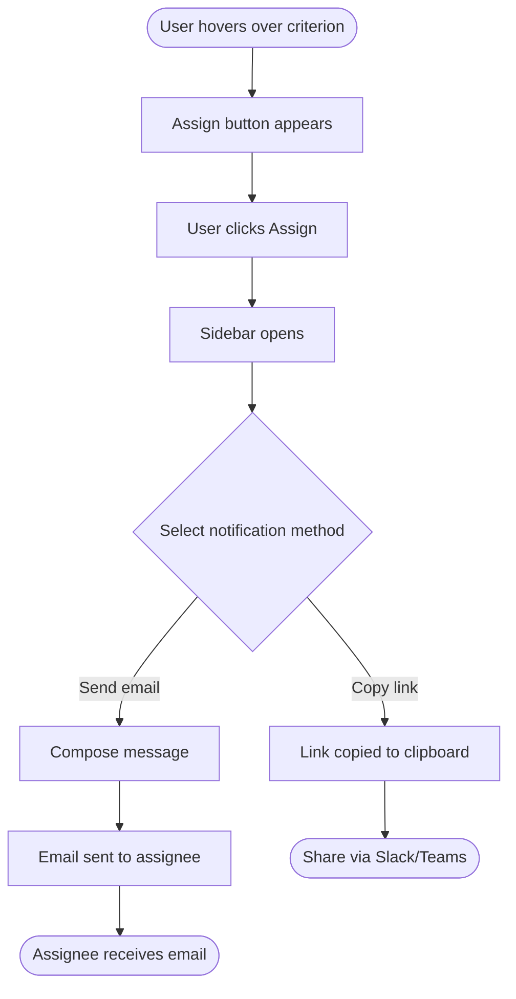

# Flow Diagram Generation (PM-Facing)

Generate Mermaid flowcharts and sequence diagrams in business language for PM review alongside BDD scenarios.

## Purpose

Support the **specification phase** by:
1. Visualizing user flows as Mermaid flowcharts (single-user decision paths)
2. Visualizing multi-party interactions as Mermaid sequence diagrams (who does what, in what order)
3. Using business language throughout (no API paths, HTTP codes, or technical jargon)

## When to Use

- **Default behavior** — diagrams are generated unless `--no-diagrams` flag is passed
- **Complex user flows** — branching paths, multiple decision points
- **Multi-party interactions** — sender/system/assignee handoffs
- **PM review** — visuals help PMs validate behavior faster than text alone

## When NOT to Use

- **`--no-diagrams` flag** — user explicitly opted out
- **Trivial features** — single linear flow with no branching (diagram adds no value)
- **Technical architecture diagrams** — use `/design` for system-level diagrams

## Language Rules

Same constraint as all `/specify` outputs — **business language only**.

| Technical (NOT this) | PM-facing (Use this) |
|---------------------|---------------------|
| `POST /api/assign` | `Assign criterion` |
| `200 OK / 403 Forbidden` | `Success / Access denied` |
| `JWT validation` | `User is logged in` |
| `Database lookup` | `System checks access` |
| `Kafka event published` | `System sends notification` |

## Diagram Types

### 1. Flowcharts — Single-User Decision Paths

Use for features where a single user makes decisions that lead to different outcomes.

**When to use:** User has choices, conditional paths, or branching logic.

**Template:**


**Style guidelines:**
- Use `[rectangles]` for actions/states
- Use `{diamonds}` for decisions
- Use `([rounded])` for start/end points
- Label edges with the condition or choice
- Keep to 5-10 nodes max — split into multiple diagrams if larger
- Use descriptive node labels in business language

**Example:**



### 2. Sequence Diagrams — Multi-Party Interactions

Use for features where multiple actors (users, system) interact over time.

**When to use:** Handoffs between people, system-mediated communication, notification flows.

**Template:**


**Style guidelines:**
- Use `actor` for people, `participant` for systems
- Name actors by role, not by technical identifier
- Use `->>` for actions, `-->>` for responses/confirmations
- Use `Note over` for context or business rules
- Keep to 8-12 interactions max per diagram
- Add `alt`/`else` blocks for conditional paths

**Example:**


## Generation Process

### Step 1: Identify Flow Types from BDD Scenarios

Scan approved BDD scenarios and group them:
- **Single-user flows** → Flowchart (user makes decisions, sees outcomes)
- **Multi-party flows** → Sequence diagram (user A triggers, system mediates, user B responds)

### Step 2: Generate Flowcharts for User Decision Paths

For each major user flow with branching:
1. Identify the starting trigger (e.g., "User hovers over criterion")
2. Map decision points (e.g., "Copy link or send email?")
3. Map outcomes for each path
4. Keep to one flowchart per major flow — don't combine unrelated flows

### Step 3: Generate Sequence Diagrams for Multi-Party Interactions

For each flow involving multiple actors:
1. Identify all actors (by role, not name)
2. Map the interaction timeline
3. Add notes for business rules that apply at specific steps
4. Use `alt`/`else` for conditional paths

### Step 4: Write to File

**Output location:** `.claude/design/[feature-name]-flows.md`

## Output Format

```markdown
# Flow Diagrams: [Feature Name]

**Feature:** [Feature description]
**Date:** [YYYY-MM-DD]
**Source:** .claude/design/[feature]-bdd.feature
**Status:** Draft

---

## User Flows

### [Flow Name 1]

[Brief description of what this flow covers]


### [Flow Name 2]

[Brief description]


---

## Interaction Diagrams

### [Interaction Name 1]

[Brief description of who interacts and why]

```mermaid
sequenceDiagram
    ...
```

### [Interaction Name 2]

[Brief description]

```mermaid
sequenceDiagram
    ...
```

---

## Diagram Index

| Diagram | Type | Covers |
|---------|------|--------|
| [Flow Name 1] | Flowchart | [Which BDD scenarios it visualizes] |
| [Interaction Name 1] | Sequence | [Which BDD scenarios it visualizes] |
```

## Limits

- Maximum 4 flowcharts per feature
- Maximum 3 sequence diagrams per feature
- Maximum 10 nodes per flowchart
- Maximum 12 interactions per sequence diagram
- If more are needed, the feature should likely be split

## Best Practices

### 1. One Diagram Per Concept

Don't cram everything into one diagram. Split by:
- Version (V1 flow vs. V2 flow)
- Actor perspective (sender flow vs. receiver flow)
- Feature area (assignment flow vs. notification flow)

### 2. Diagram Should Stand Alone

Each diagram should be understandable without reading the BDD scenarios. Include enough labels and notes for context.

### 3. Cross-Reference BDD Scenarios

In the Diagram Index table, map each diagram to the BDD scenarios it visualizes. This helps PMs trace from visual to acceptance criteria.

### 4. Keep It Simple

If a flow is linear with no branching, skip the flowchart — the BDD scenario is sufficient. Only create diagrams when they add clarity beyond what text provides.

## Related Documentation

- **Skill overview:** [skills/specify/SKILL.md](SKILL.md)
- **Business rules:** [skills/specify/business-rules.md](business-rules.md)
- **BDD scenarios:** [skills/specify/bdd-scenarios.md](bdd-scenarios.md)
