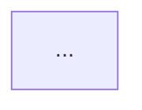

# Flow Diagrams — Output Format Example

Full example of a completed flow diagrams document.

```markdown
# Flow Diagrams: [Feature Name]

**Feature:** [Feature description]
**Date:** [YYYY-MM-DD]
**Source:** .claude/design/[feature]-bdd.feature
**Status:** Draft

---

## User Flows

### [Flow Name 1]

[Brief description of what this flow covers]



### [Flow Name 2]

[Brief description]


---

## Interaction Diagrams

### [Interaction Name 1]

[Brief description of who interacts and why]

```mermaid
sequenceDiagram
    ...
```

### [Interaction Name 2]

[Brief description]

```mermaid
sequenceDiagram
    ...
```

---

## Diagram Index

| Diagram | Type | Covers |
|---------|------|--------|
| [Flow Name 1] | Flowchart | [Which BDD scenarios it visualizes] |
| [Interaction Name 1] | Sequence | [Which BDD scenarios it visualizes] |
```
